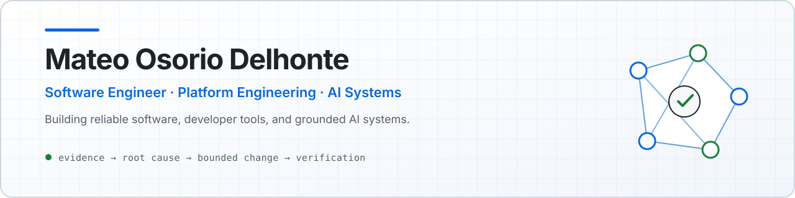

<picture>
  <source media="(prefers-color-scheme: dark)" srcset="./assets/profile-banner-dark.svg">
  <source media="(prefers-color-scheme: light)" srcset="./assets/profile-banner-light.svg">
  
</picture>

  <h1>Mateo Osorio Delhonte</h1>
  
<strong>Software Engineer · Platform Engineering · AI Systems</strong>

  

    
    
  

  
From Lima, Peru 🇵🇪 · Working in Utah, USA 🇺🇸

I build and validate client-facing software across frontend, backend, APIs, data, QA, and release workflows. I care about systems that expose their evidence, handle unknown states honestly, and stay understandable under review.

## What I do at work

- Build and review frontend and backend features for client-facing platform surfaces.
- Investigate route quality, API contracts, data coverage gaps, and unavailable-state behavior.
- Use Playwright, automated QA, regression validation, and release-readiness checks to verify changes end to end.
- Audit codebases and architecture, debug production behavior, drive scoped issue/PR workflows, and write technical documentation.

AI supports this work as an engineering assistant for investigation, implementation, and review—but its output still has to clear the same evidence and verification bar as any other change.

## Featured projects

| Project | What it demonstrates |
| --- | --- |
| **[RepoSignal](https://github.com/mateoosoriodelhonte/reposignal)**    [Live demo](https://reposignal-lovat.vercel.app) | An evidence-backed engineering health analyzer for GitHub repositories. It normalizes GitHub API data before applying deterministic, testable scoring; preserves missing evidence as unknown rather than zero; and supports selected private repositories through a read-only GitHub App path.  **TypeScript · Next.js · React · PostgreSQL · Prisma · Playwright · GitHub Actions** |
| **[StudyForge](https://github.com/mateoosoriodelhonte/studyforge)**   | A local-first study system that ingests pasted text, text files, and PDFs; builds traceable flashcards and quizzes; and schedules reviews with FSRS-6. It is fully useful in no-AI mode, with optional local Ollama support.  **Python · FastAPI · HTMX · SQLAlchemy · SQLite** |
| **[ProcessPilot](https://github.com/mateoosoriodelhonte/processpilot)**   | A privacy-first, read-only macOS process monitor built around normal unprivileged telemetry. Rust collects narrow process evidence; Go validates and groups it, records bounded SQLite resource history, detects documented anomalies, and can request optional loopback-only Ollama explanations. It does not inspect process contents or control processes.  **Rust · Go · SQLite · Ollama (optional)** |

## AI, RAG & agentic engineering

I’m interested in AI systems that retrieve trustworthy context before reasoning—relevant code, documentation, requirements, and evidence rather than ungrounded confidence.

| Area | Current focus |
| --- | --- |
| **Retrieval** | Retrieval-Augmented Generation, hybrid retrieval, semantic search, and vector search |
| **Context** | Context engineering, chunking, reranking, provenance, and source selection |
| **Agents** | Tool-using agent workflows, multi-agent orchestration, and bounded execution |
| **Evaluation** | Retrieval quality, grounded generation, traceable outputs, and evidence-backed review |

The goal is not to make AI sound certain. It is to give the system better context, explicit boundaries, and a verification path.

## Engineering stack

| | Technologies and practices |
| --- | --- |
| **Languages** | TypeScript, JavaScript, Python, SQL, Go, Rust |
| **Web & platform** | React, Next.js, Node.js, FastAPI, HTMX |
| **Data** | PostgreSQL, SQLite, Prisma, SQLAlchemy |
| **AI systems** | RAG, context engineering, agent workflows, Ollama |
| **Quality & delivery** | Playwright, GitHub Actions, API validation, automated QA, regression verification |

## Open source

- **[sandplover PR #261](https://github.com/sandpiper-toolchain/sandplover/pull/261)** — open draft contribution with a regression-tested fix so compensation NaN validation follows the clipped working array. This is an open contribution, not a merged claim.

## GitHub activity

Public contribution data is kept here as supporting context; the projects above are the primary record of what I build.

<a href="https://github.com/mateoosoriodelhonte">
  <picture>
    <source media="(prefers-color-scheme: dark)" srcset="https://github-readme-activity-graph.vercel.app/graph?username=mateoosoriodelhonte&amp;theme=github-dark&amp;hide_border=true&amp;area=true&amp;custom_title=Public%20Contribution%20Activity">
    <source media="(prefers-color-scheme: light)" srcset="https://github-readme-activity-graph.vercel.app/graph?username=mateoosoriodelhonte&amp;theme=github-light&amp;hide_border=true&amp;area=true&amp;custom_title=Public%20Contribution%20Activity">
    
  </picture>
</a>

  <a href="https://github.com/mateoosoriodelhonte">
    <picture>
      <source media="(prefers-color-scheme: dark)" srcset="https://github-profile-summary-cards.vercel.app/api/cards/stats?username=mateoosoriodelhonte&amp;theme=github_dark">
      <source media="(prefers-color-scheme: light)" srcset="https://github-profile-summary-cards.vercel.app/api/cards/stats?username=mateoosoriodelhonte&amp;theme=github">
      
    </picture>
  </a>

## How I work

**evidence → root cause → bounded change → implementation → tests → review → verification**

I prefer reviewable changes with clear ownership and observable proof. I use AI to accelerate investigation and implementation, not to replace technical judgment, testing, or human review.

## Current learning

I’m continuing to deepen my work in RAG architecture and evaluation, system design, AI agents, Rust and Go systems engineering, open-source contribution, and reliable AI-assisted development.

## Connect

If you want to talk about platform reliability, developer tools, or grounded AI systems, connect with me on **[LinkedIn](https://www.linkedin.com/in/mateo-osorio-5a93452ab)** or explore **[my public repositories](https://github.com/mateoosoriodelhonte?tab=repositories)**.
